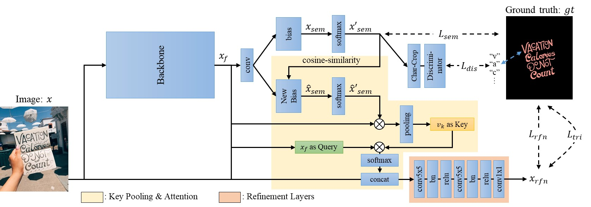

# Rethinking Text Segmentation: A Novel Dataset and A Text-Specific Refinement Approach

This is the repo to host the dataset TextSeg and code for TexRNet from the following paper:

[Xingqian Xu](https://ifp-uiuc.github.io/), [Zhifei Zhang](http://web.eecs.utk.edu/~zzhang61/), [Zhaowen Wang](https://research.adobe.com/person/zhaowen-wang/), [Brian Price](https://research.adobe.com/person/brian-price/), [Zhonghao Wang](https://ifp-uiuc.github.io/) and [Humphrey Shi](https://www.humphreyshi.com), **Rethinking Text Segmentation: A Novel Dataset and A Text-Specific Refinement Approach**, [ArXiv Link](arxiv.org/abs/2011.14021) 

**Note:**
<!--
Our dataset and code are released, please send in a request for dataset download.
-->
<s>\[2021.04.21\] So far, our dataset is partially released with images and semantic labels. Since many people may request the dataset for OCR or non-segmentation tasks, please stay tuned, and we will release the dataset in full ASAP.</s>

\[2021.06.18\] **Our dataset is now fully released.** To download the data, please send a request email to *textseg.dataset@gmail.com* and tell us which school you are affiliated with. Please be aware the released dataset is **version 2**, and the annotations are slightly different from the one in the paper. In order to provide the most accurate dataset, we went through a second round of quality assurance, in which we fixed some faulty annotations and made them more consistent across the dataset. Since our TexRNet in the paper doesn't use OCR and character instance labels (*i.e.* word- and character-level bounding polygons; character-level masks;), we will not release the older version of these labels. However, we release the retroactive ```semantic_label_v1.tar.gz``` for researchers to reproduce the results in the paper. For more details about the dataset, please see below.

## Introduction
Text in the real world is extremely diverse, yet current text dataset does not reflect such diversity very well. To bridge this gap, we proposed TextSeg, a large-scale fine-annotated and multi-purpose text dataset, collecting scene and design text with six types of annotations: word- and character-wise bounding polygons, masks and transcriptions. We also introduce Text Refinement Network (TexRNet), a novel text segmentation approach that adapts to the unique properties of text, e.g. non-convex boundary, diverse texture, etc., which often impose burdens on traditional segmentation models. TexRNet refines results from common segmentation approach via key features pooling and attention, so that wrong-activated text regions can be adjusted. We also introduce trimap and discriminator losses that show significant improvement on text segmentation. 

## TextSeg Dataset

### Image Collection

<p align="center">
  
</p>

### Annotation

<p align="center">
  
</p>

### Download

Our dataset (TextSeg) is academia-only and cannot be used on any commercial project and research. To download the data, please send a request email to *textseg.dataset@gmail.com* and tell us which school you are affiliated with. 

A full download should contain these files:

* ```image.tar.gz``` contains 4024 images.
* ```annotation.tar.gz``` labels corresponding to the images. These three types of files are included:
  * ```[dataID]_anno.json``` contains all word- and character-level translations and bounding polygons.
  * ```[dataID]_mask.png``` contains all character masks. Character mask label value will be ordered from 1 to n. Label value 0 means background, 255 means ignore. 
  * ```[dataID]_maskeff.png``` contains all character masks **with effect**. 
  * ```Adobe_Research_License_TextSeg.txt``` license file.
* ```semantic_label.tar.gz``` contains all word-level (semantic-level) masks. It contains:
  * ```[dataID]_maskfg.png``` 0 means background, 100 means word, 200 means word-effect, 255 means ignore. (The ```[dataID]_maskfg.png``` can also be generated using ```[dataID]_mask.png``` and ```[dataID]_maskeff.png```)
* ```split.json``` the official split of train, val and test.
* [Optional] ```semantic_label_v1.tar.gz``` the old version of label that was used in our paper. One can download it to reproduce our paper results.

## TexRNet Structure and Results

<p align="center">
  
</p>

In this table, we report the performance of our TexRNet on 5 text segmentation dataset including ours. 

<font size="11" face="Courier New">
<table>
  <tr>
    <td></td>
    <td colspan="2">TextSeg(Ours)</td>
    <td colspan="2">ICDAR13 FST</td>
    <td colspan="2">COCO_TS</td>
    <td colspan="2">MLT_S</td>
    <td colspan="2">Total-Text</td>
  </tr>
  <tr>
    <td>Method</td>
    <td>fgIoU</td><td>F-score</td>
    <td>fgIoU</td><td>F-score</td>
    <td>fgIoU</td><td>F-score</td>
    <td>fgIoU</td><td>F-score</td>
    <td>fgIoU</td><td>F-score</td>
  </tr>
  <tr>
    <td>DeeplabV3+</td>
    <td>84.07</td><td>0.914</td>
    <td>69.27</td><td>0.802</td>
    <td>72.07</td><td>0.641</td>
    <td>84.63</td><td>0.837</td>
    <td>74.44</td><td>0.824</td>
  </tr>
  <tr>
    <td>HRNetV2-W48</td>
    <td>85.03</td><td>0.914</td>
    <td>70.98</td><td>0.822</td>
    <td>68.93</td><td>0.629</td>
    <td>83.26</td><td>0.836</td>
    <td>75.29</td><td>0.825</td>
  </tr>
  <tr>
    <td>HRNetV2-W48 + OCR</td>
    <td>85.98</td><td>0.918</td>
    <td>72.45</td><td>0.830</td>
    <td>69.54</td><td>0.627</td>
    <td>83.49</td><td>0.838</td>
    <td>76.23</td><td>0.832</td>
  </tr>
  <tr>
    <td>Ours: TexRNet + DeeplabV3+</td>
    <td>   86.06    </td><td>   0.921    </td>
    <td>   72.16    </td><td>   0.835    </td>
    <td><b>73.98</b></td><td><b>0.722</b></td>
    <td><b>86.31</b></td><td>   0.830    </td>
    <td>   76.53    </td><td>   0.844    </td>
  </tr>
  <tr>
    <td>Ours: TexRNet + HRNetV2-W48</td>
    <td><b>86.84</b></td><td><b>0.924</b></td>
    <td><b>73.38</b></td><td><b>0.850</b></td>
    <td>   72.39    </td><td>   0.720    </td>
    <td>   86.09    </td><td><b>0.865</b></td>
    <td><b>78.47</b></td><td><b>0.848</b></td>
  </tr>
</table>
</font>

## To run the code

### Set up the environment
```
conda create -n texrnet python=3.7
conda activate texrnet
pip install -r requirement.txt
```
### To eval

First, make the following directories to hold pre-trained models, dataset, and running logs:
```
mkdir ./pretrained
mkdir ./data
mkdir ./log
```

Second, download the models from [this link](https://drive.google.com/drive/folders/1EvGNvI5R6NKsW0YTy_0YHD9dpvtM0HDi?usp=sharing). Move those downloaded models to `./pretrained`. 

Thrid, make sure that `./data` contains the data. A sample root directory for **TextSeg** would be `./data/TextSeg`.

Lastly, evaluate the model and compute fgIoU/F-score with the following command: 
```
python main.py --eval --pth [model path] [--hrnet] [--gpu 0 1 ...] --dsname [dataset name]
```

Here is the sample command to eval a TexRNet_HRNet on TextSeg with 4 GPUs:
```
python main.py --eval --pth pretrained/texrnet_hrnet.pth --hrnet --gpu 0 1 2 3 --dsname textseg
```

The program will store results and execution log in `./log/eval`. 

### To train

Similarly, these directories need to be created:
```
mkdir ./pretrained
mkdir ./pretrained/init
mkdir ./data
mkdir ./log
```

Second, we use multiple pre-trained models for training. Download these initial models from [this link](https://drive.google.com/drive/folders/1EvGNvI5R6NKsW0YTy_0YHD9dpvtM0HDi?usp=sharing). Move those models to `./pretrained/init`. Also, make sure that `./data` contains the data. 

Lastly, execute the training code with the following command: 
```
python main.py [--hrnet] [--gpu 0 1 ...] --dsname [dataset name] [--trainwithcls]
```

Here is the sample command to train a TexRNet_HRNet on TextSeg with classifier and discriminate loss using 4 GPUs:
```
python main.py --hrnet --gpu 0 1 2 3 --dsname textseg --trainwithcls
```

The training configs, logs, and models will be stored in `./log/texrnet_[dsname]/[exid]_[signature]`.

## Bibtex
```
@article{xu2020rethinking,
  title={Rethinking Text Segmentation: A Novel Dataset and A Text-Specific Refinement Approach},
  author={Xu, Xingqian and Zhang, Zhifei and Wang, Zhaowen and Price, Brian and Wang, Zhonghao and Shi, Humphrey},
  journal={arXiv preprint arXiv:2011.14021},
  year={2020}
}
```

## Acknowledgements

The directory `.\hrnet_code` is directly copied from the HRNet official github website [(link)](https://github.com/HRNet/HRNet-Semantic-Segmentation). HRNet code ownership should be credited to HRNet authors, and users should follow their terms of usage. 
